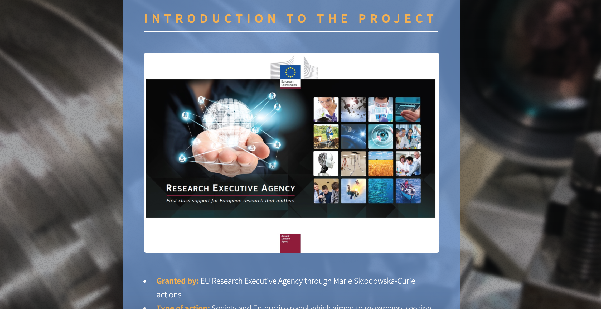
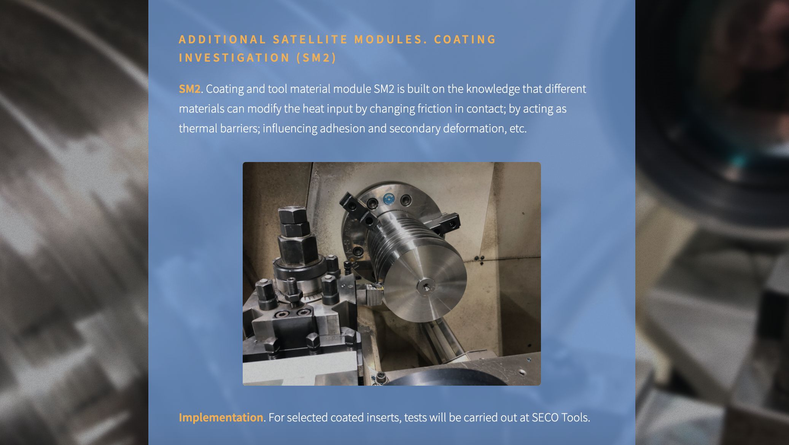

# MoMenT

Web application for Modelling and Measurement of Thermal Phenomena in Metal Cutting Project granted by: EU Research Executive Agency through Marie Skłodowska-Curie actions. Volunteer assignment.

1. How to deploy a Simple Static HTML Website on Heroku

https://medium.com/@agavitalis/how-to-deploy-a-simple-static-html-website-on-heroku-492697238e48

2. HTML5 UP! Responsive HTML5 and CSS3 Site Templates

https://html5up.net/
